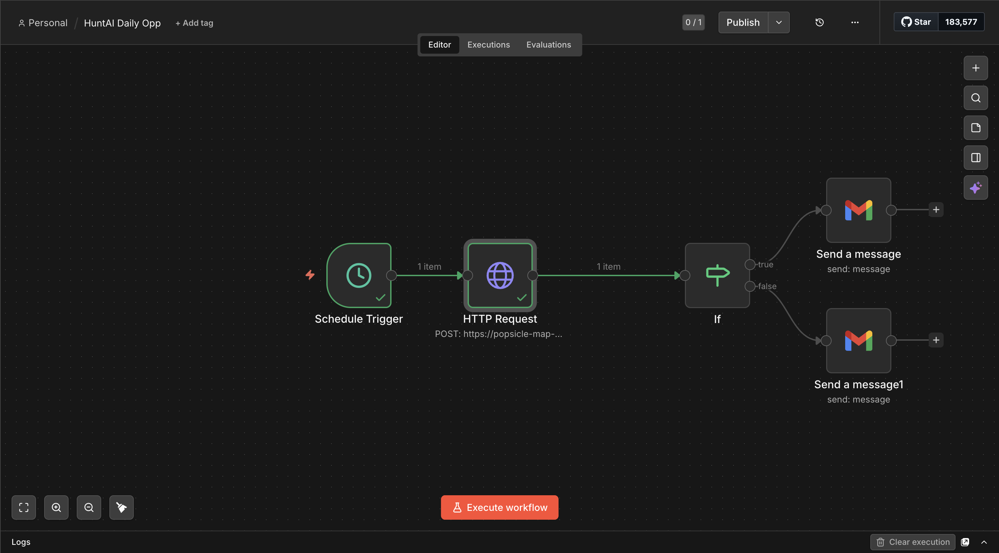

HuntAI – Daily Opportunity Brief

HuntAI is a small system I built to make job searching less chaotic.

Instead of scrolling through job boards every day, the idea is to get a short list of roles that actually make sense, plus one recommendation that is worth applying to.

Right now it runs once a day and sends me an email with the results.

What it does

- Calls a backend API that returns job listings
- Filters and scores them based on some basic rules
- Picks one role as the best option for the day
- Sends everything to my email so I can review quickly

How it works

The workflow is handled in n8n.

Schedule Trigger → HTTP Request → IF → Email

If a good match is found, it sends a detailed email.
If not, it sends a simple update saying nothing stood out.

Breakdown

Schedule Trigger
Runs the workflow once a day

HTTP Request
Hits the FastAPI endpoint at /run-hunt and gets job data

IF Node
Checks if a recommended job exists

Email (Gmail)
Sends either:
- a full opportunity summary
- or a no-match message

Example output

Top jobs:
1. Software Engineer at Vercel
2. Backend Engineer at Stripe
3. Platform Engineer at Snowflake

Recommended:
Software Engineer at Vercel

Score: 96
Verdict: Strong apply

Why this role makes sense:
Good overlap with backend and infrastructure work

How to position:
Focus on distributed systems and observability projects

Next step:
Apply with a tailored resume

Tech stack

- FastAPI for the backend
- n8n for workflow automation
- ngrok to expose the local API
- Gmail for sending emails

Example request

{
  "mode": "opportunity_brief",
  "limit": 5,
  "min_score": 45,
  "max_per_company": 2,
  "us_only": true,
  "remote_only": false,
  "strategy_mode": "safe_apply"
}

Current state

- Backend endpoint is working
- n8n workflow is connected end to end
- Emails are being sent correctly
- Daily automation is set up

Limitations

- ngrok URL changes when restarted
- same jobs can show up multiple times
- no tracking of applied jobs yet

Next things to add

- avoid showing duplicate jobs
- support different strategies like targeting specific companies
- generate tailored resumes automatically
- clean up email formatting

## Workflow

This workflow runs daily, evaluates job opportunities, and sends a curated summary via email.

Why I made this

Most job tools either show too much or require too much effort.

I wanted something that reduces everything to a simple daily decision.

Instead of browsing for an hour, I just check one email and decide whether to apply.
